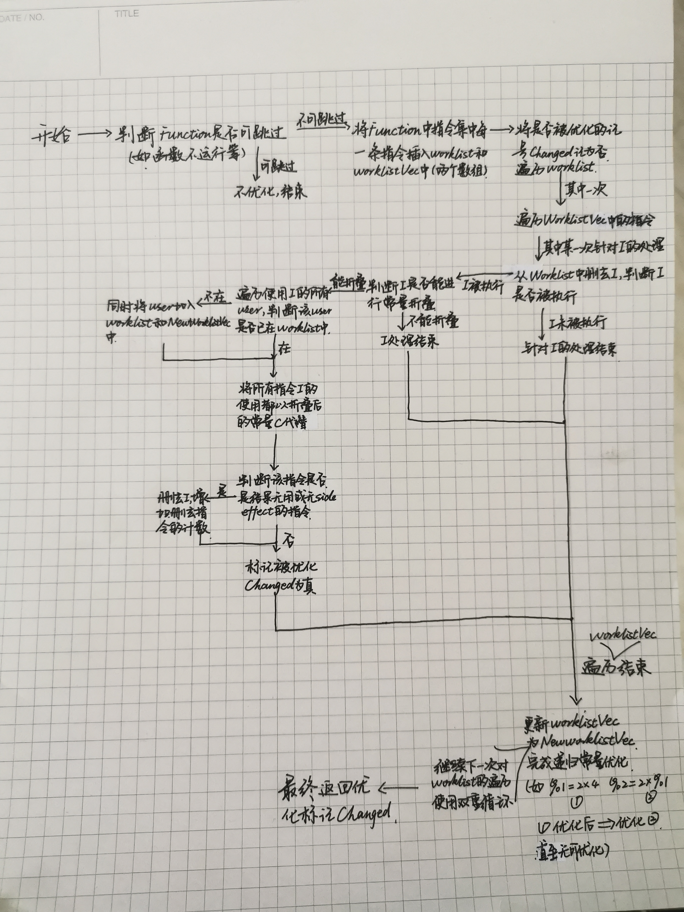
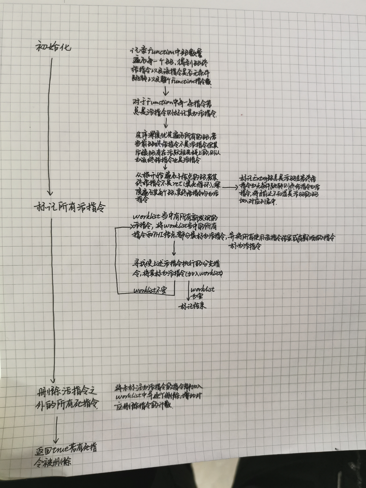

# lab3-2实验报告

PB17010420 庞继泽  
PB17111648 卢佳敏  
PB17111626 秦亚璇   

## 实验要求

本次实验中，我们需要使用opt工具，并阅读源代码来了解LLVM中如何使用Pass对IR进行优化。
实验需要我们主动学习llvm和尚未掌握的C++语言知识，善用搜索引擎，官方文档等学习工具，全面理解llvm代码优化流程，并且学以致用。

## 报告内容 
### 1 ConstProp
#### 类型及作用：
类型：`ConstantPropagation`是`FunctionPass`的子类，该优化以`Function`为基本单元进行优化。  
作用：该pass主要用于执行代码优化中的常量传播和合并（常量折叠），它寻找只包含常量操作数的指令，在进行编译器编译分析时会直接进行计算并用常量值代替指令替换它们。例如：add i32 1, 2指令会被消除而直接成为常数3存在。

#### LLVM IR优化举例：
优化前的手动构造IR代码：

```
define i32 @main()
{
	%1 = alloca i32
	%2 = mul i32 8,9
	store i32 %2,i32* %1
	%A = add i32 4,5
	ret i32 %A
}
```

使用`opt -S -constprop test.ll`后：

```
define i32 @main()
{
	%1 = alloca i32
	store i32 72, i32* %1
	ret i32 9
}
```

可以看到，源文件被进行了优化，其中8*9被直接用72代替，而不再使用中间变量%2进行计算结果存储，后续使用%2的地方也被常数值72直接替代。使用中间变量%A存储的常量则被直接删去，ret直接返回常值而非%A。通过常量折叠实现了指令数的减少和程序的有效优化。

#### 该PASS的流程：
文件开头给出了一些必要的变量和结构，不是本次实验的重点，不做赘述，下面给出优化全过程的流程图如下：  



```
if (skipFunction(F)) return false;
```

这是执行可选PASS时推荐进行的预检测，目的是检查该PASS会不会由于`OptimizeNone`设为1而需要跳过这个PASS等需要跳过的情况。


```
SmallPtrSet<Instruction *, 16> WorkList;

SmallVector<Instruction *, 16> WorkListVec;

for (Instruction &I : instructions(&F)) 
  {
    WorkList.insert(&I);
    WorkListVec.push_back(&I);//将指令插在最后面
  }
```

这里初始化两个集合用来存储function中的指令。随后按照各自的元素插入规则把指令放进集合中，进行初始化。


```
bool Changed = false;
```

这里的布尔值记录是否进行了优化

```
const DataLayout &DL = F.getParent()->getDataLayout();
```

DataLayout存储了包含指令集F的module的target platform

```
if (Constant *C = ConstantFoldInstruction(I, DL, TLI))
```

如果成功进行了常量折叠的话，就能进行对应的优化 

```
for (User *U : I->users()) 
          {
            if (WorkList.insert(cast<Instruction>(U)).second)
              NewWorkListVec.push_back(cast<Instruction>(U));
          }
```

对于该指令的每一个user，如果不在worklist当中就同时将其插入worklist和newworklistvec中，具体作用说明请见流程图。

```
I->replaceAllUsesWith(C);
```

将所有能够计算出结果的变量直接替换为常量

```
WorkListVec = std::move(NewWorkListVec);
```

优化后的指令集赋给原指令集

当该优化过程遍历了Function的所有指令后，优化完成。

### 2 ADCE
#### 类型及作用
 类型：该pass是`FunctionPass`的子类，该优化以`Function`为基本单元进行优化。    
 作用：该文件执行激进的死代码删除，它假设所有的指令都是死的，除非有可靠信息证明其是活的，最终将所有不能证明是活指令的指令全部删除。本PASS可以删除一些其他的死代码删除不能删去的死计算，特别是循环计算。


#### LLVM IR优化举例：

下面给出使用adce优化的样例：
##### 2.1

c 源码：

```c
int main(void) {
    int a = 1; int b = 3;
    a = a + a*b + a - b ;
    int c = 1;
    if (a > b) {
        c = c + 1;
    }
    return 0;
}
```

clang 生成后用 sroa 优化：

```assembly
define dso_local i32 @main() {
  %1 = mul nsw i32 1, 3
  %2 = add nsw i32 1, %1
  %3 = add nsw i32 %2, 1
  %4 = sub nsw i32 %3, 3
  %5 = icmp sgt i32 %4, 3
  br i1 %5, label %6, label %8

; <label>:6:                                      ; preds = %0
  %7 = add nsw i32 1, 1
  br label %8

; <label>:8:                                      ; preds = %6, %0
  ret i32 0
}
```

sroa 优化后再用 dce 优化：

```assembly
define dso_local i32 @main() {
  %1 = mul nsw i32 1, 3
  %2 = add nsw i32 1, %1
  %3 = add nsw i32 %2, 1
  %4 = sub nsw i32 %3, 3
  %5 = icmp sgt i32 %4, 3
  br i1 %5, label %6, label %7

; <label>:6:                                      ; preds = %0
  br label %7

; <label>:7:                                      ; preds = %6, %0
  ret i32 0
}
```

sroa 优化后再用 adce 优化：

```assembly
define dso_local i32 @main() {
  br label %2
                                                  ; No predecessors!
  br label %2

; <label>:2:                                      ; preds = %0, %1
  ret i32 0
}
```
该代码首先确定了两条指令为活指令，ret和无条件br，其他的所有指令均为没有有效证据证明为活指令的指令，同时我们能够观察到无条件跳转语句和ret语句结果均不会被其他指令使用或是对其他指令产生影响，故其他的所有指令会被adce全部优化删除，而通过上述代码比较可以看出，dce显然不能完成如此彻底的指令优化，足见adce的激进。


##### 2.2
c 程序：

```c
int main(void) {
    int a = 1;
    while (0) {
        a = a+1;
    }
    return 0;
}
```

用 clang 生成的 `.ll` 文件：

```assembly
define dso_local i32 @main() #0 {
  %1 = alloca i32, align 4
  %2 = alloca i32, align 4
  store i32 0, i32* %1, align 4
  store i32 1, i32* %2, align 4
  br label %3

; <label>:3:                                      ; preds = %4, %0
  br i1 false, label %4, label %7

; <label>:4:                                      ; preds = %3
  %5 = load i32, i32* %2, align 4
  %6 = add nsw i32 %5, 1
  store i32 %6, i32* %2, align 4
  br label %3

; <label>:7:                                      ; preds = %3
  ret i32 0
}
```

再用 sroa 优化后

```assembly
define dso_local i32 @main() {
  br label %1

; <label>:1:                                      ; preds = %2, %0
  %.0 = phi i32 [ 1, %0 ], [ %3, %2 ]
  br i1 false, label %2, label %4

; <label>:2:                                      ; preds = %1
  %3 = add nsw i32 %.0, 1
  br label %1

; <label>:4:                                      ; preds = %1
  ret i32 0
}
```

最后用 adce 优化后能删去循环内的死代码：

```assembly
define dso_local i32 @main() {
  br label %1

; <label>:1:                                      ; preds = %2, %0
  br i1 false, label %2, label %3

; <label>:2:                                      ; preds = %1
  br label %1

; <label>:3:                                      ; preds = %1
  ret i32 0
}
```
由上可见，经过adce优化后一个无用的phi节点被删去了，因为terminator为活指令的情况下，活指令执行所需要的必要的控制流相关指令或是使用活指令结果并产生影响的指令中并不存在该PHI指令（详见markliveinstructions函数），所以不能被marklive，故该指令被直接优化掉了，同样的理由由于对活指令的执行没有任何影响同样也不会被影响，%3的赋值指令同样被优化掉了。这是dce所不能完成的事情，即默认所有指令都是死代码，除非必要不做保留。
##### 2.3
该样例是dce和adce均能够完成优化的样例，以此证明adce能够完成dce所做的事情，符合我们的实验预期。
ll文件：

```
define i32 @main(){
entry:
	%0 = alloca i32
	%1 = alloca i32
	%2 = alloca i32
	%3 = alloca i32
	%4 = alloca i32
    store i32 1,i32* %1
	%5 = load i32, i32* %2
	store i32 6, i32* %0
	%6 = load i32, i32* %0
	store i32 %6, i32* %0
	br label %retBB

retBB:
	%7 = load i32, i32* %0
	ret i32 %7

}
```

进行优化后：

```
define i32 @main() {
entry:
	%0 = alloca i32
	%1 = alloca i32
	%2 = alloca i32
	store i32 1,i32* %1
	store i32 6,i32* %2
	%3 = load i32, i32
	store i32 %3, i32* %0
	br label %retBB

retBB:
	%4 = load i32, i32* %0
	ret i32 %4 
}
```
优化删除了无用的load和没有用到的alloca。

##### 2.4

```
define i32 @main(){
entry:
	%0 = alloca i32
	%1 = alloca i32
	%2 = alloca i32
	%3 = load i32,i32* %1
	store i32 1,i32* %1
	%4 = load i32,i32* %2
	store i32 6,i32* %2
	br i1 false, label %trueBB, label %jumpoutBB

trueBB:
	%5 = alloca i32
	br label %jumpoutBB

jumpoutBB:
	%6 = load i32,i32* %1
	%7 = load i32,i32* %1
	%8 = add nsw i32 %7,1
	store i32 %8,i32* %1
	store i32 1,i32* %0
	br label %retBB

retBB:
	%9 = load i32,i32* %0
	ret i32 %9


}
```

优化后：

```
define i32 @main(){
	%0 = alloca i32
	%1 = alloca i32
	%2 = alloca i32
	store i32 1,i32* %1
	store i32 6,i32* %2
	br label %jumpoutBB

trueBB:
	br label %jumpoutBB

jumpoutBB:
	%3 = load i32, i32* %1
	%4 = add nsw i32 %3,1
	store i32 %4, i32* %1
	store i32 1,i32* %0
	br label %retBB

retBB:
	%5 = load i32, i32* %0
	ret i32 %5

}
```
通过优化将无用的分支跳转br i1 false, label %trueBB, label %jumpoutBB改为了无条件跳转br label %jumpoutBB，这是因为成为terminator的分支跳转语句不会被认为是always alive的指令，进而通过makeUnconditional函数，将其转化为两个BB之间的无条件跳转，完成优化

##### 2.5

原代码：

```assembly
define dso_local i32 @main() #0 {
  %1 = alloca [10 x i32], align 16
  %2 = getelementptr inbounds [10 x i32], [10 x i32]* %1, i64 0, i64 2
  %3 = load i32, i32* %2, align 8
  ret i32 0
}
```

adce 优化后：

```assembly
define dso_local i32 @main() {
  ret i32 0
}
```
这同样是dce也能够完成的一个优化，以数组类型来丰富样例的普适性。
#### 该PASS的流程：
先简单的描述一下算法：

```
procedure eliminateDeadCode(P)	
		//P is the procedure in which constants are to be propagated
		//Assume the availability of def-use chains for all the statements in P
		let worklist := {absolutely useful statements}
		
		while worklist ≠ Ø do begin
			x:= an arbitrary element of worklist
			make x useful
			worklist := worklist - {x}
			for all (y, x) ∈ defuse do
				if y is not marked useful then
					worklist := worklist ∪ {y};
				end
			end
		end
		delete every statement that is not marked useful
end eliminateDeadCode
```

1.假设存在这样一个集合worklist， 这个集合里面的所有的指令都是一定会被使用的；

2.那么我们遍历这个指令， 并将这个集合中的所有的指令标为有效。

3.假设当前遍历出来的指令为X， 那么检查当前有哪些其他的指令使用了这条指令， 并将使这些指令标记为有效， 最后吧这些指令加入worklist；

4.循环执行1， 如果worklist为空， 那么停止循环。

5.最后遍历所有的指令， 删除没有被标记为有效的指令。



总之，初始化部分完成了将最基础的已知活指令加入worklist（如无条件br，rt等）的任务（通过调用相关mark函数），在marklive部分将这些指令以及受其影响，影响他们的指令全部标注为活指令，最终将未被标注为活指令的指令全部删除

代码实现方面：

ADCE中使用了两个变长数组alive和worklist， worklist主要包含待扫描的指令， alive包含不需要被删除的活指令， 不用被删除。

扫描全部指令， 如果当前的指令是TerminatorInst， DbgInfoIntrinsic， LandingPadInst 或者 当前指令有写内存的操作，就抛出异常，call指令的返回值没有return（最后三种被统称为可能会导致副作用的指令集）。

最后扫面全部的指令， 如果当前的指令不在alive中， 直接删除。


记录一下该文件中使用到的函数及其作用

```
void initialize();
```

该函数为指令和基本块设置辅助数据结构，并将工作列表初始化为一组一定是活的的指令。

```
 bool isAlwaysLive(Instruction &I);
```

该函数判断一条指令是否是定义好的总是活指令的指令

```
bool isInstrumentsConstant(Instruction &I);
```
该函数把对值进行分析的检查指令返回true

```
void markLiveInstructions();
```

该函数把活指令的这一特性传递到定义处

```
void markLive(Instruction *I);
```

该函数标记一条活指令

```
void markLive(BasicBlock *BB)；
```

该函数标记一个块是活的

```
 void markPhiLive(PHINode *PN);
```

该函数标记一个PHI节点的控制前驱块是活的

```
void collectLiveScopes(const DILocalScope &LS);
void collectLiveScopes(const DILocation &DL);
```

该函数记录活指令的debug信息的debug范围。

```
void markLiveBranchesFromControlDependences();
```
该函数分析死分支去找到哪些分支是活BB依赖的控制流，这些分支被标记为活分支

```
bool removeDeadInstructions();
```
该函数移除没有标记为活的指令，如果有指令被移除就返回

```
void updateDeadRegions();
```

该函数识别控制流图上含有死跳转或返回语句的连接部分，重写控制流图来移除它们

```
void computeReversePostOrder();
```

该函数根据反向控制流图的后序编号设置BlockInfo::PostOrder字段。

```
void makeUnconditional(BasicBlock *BB, BasicBlock *Target);
```

该函数把这个块的终结符修改为一个无分支的到目标块的跳转

```
bool AggressiveDeadCodeElimination::performDeadCodeElimination()
{
  initialize();
  markLiveInstructions();
  return removeDeadInstructions();
}
```

先进行初始化，标记活指令，随后删除所有的死代码

```
static bool isUnconditionalBranch(Instruction *Term)
```

判断是否是无条件跳转分支


## 实验总结

通过本次实验，我们对编译器完成的部分优化情况有了深入的理解，如常量折叠，再如死代码删除，激进的死代码删除等，通过代码的阅读和优化情况的编写使我们明确了具体的可优化情况，同时查阅大量的相关资料使我们对llvm及cpp的语法有了更加深入的了解。综上，本次实验是一次相对成功的实验。

